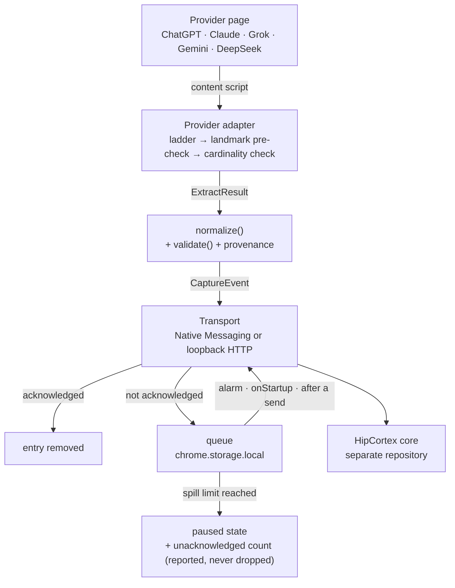

# Architecture

CortexBridge is the **sensory layer** of HipCortex. It observes AI conversations from browser
surfaces, normalizes them into a versioned contract, and forwards them to a HipCortex runtime. It
does not reason.

> **The core retains; the extension guarantees acknowledged delivery.**

The second half of that sentence is the one that constrains this codebase. The extension is not the
retention boundary, and it is not permitted to act like one: there is no drop-oldest policy, no
loss counter, and no path that discards an unacknowledged capture.

Authoritative scope decisions live in [`docs/END-STATE.md`](./END-STATE.md). The network contract
lives in [`docs/PROTOCOL.md`](./PROTOCOL.md). Where this document and either of those disagree,
those win.

## Flow

The loop back from the queue to the transport is the whole point of this diagram: it has no exit
that discards. When it cannot make progress it reports, and the queue keeps its unacknowledged
entries until the runtime acknowledges them.

## Layers and their hard rules

| Layer | Location | Hard rule |
|-------|----------|-----------|
| Content script | `src/content/entry.ts` | Observes and extracts only. It never holds durable state — the worker can be gone at any moment and so can the page. |
| Provider adapters | `src/capture/providers/*` | One adapter per site. All volatile DOM knowledge lives here and nowhere else. Selectors and landmarks are code-only: never fetched, never read from `chrome.storage`. |
| Contract | `src/schema/*` | Versioned, provider-agnostic shapes plus the egress mapping and the export document. Contains no cognitive field — no decision, belief, goal or entity. |
| Pipeline | `src/capture/pipeline.ts` | `extract → validate → send → enqueue on failure`. An invalid event never reaches the transport. |
| Queue | `src/capture/queue/*` | FIFO in `chrome.storage.local`. Removal is acknowledged-only. Reaching the spill limit pauses and reports. |
| Transport | `src/api/*` | The only place allowed to touch the network. Both transports are held to the same acknowledgement rule. |
| Migration | `src/migration/*` | Reads an export document and writes it back through the transport, one record at a time to `POST /memory/add`. It owns no network code, and it refuses a document whole rather than importing part of one. |
| Context injection | `src/inject/*` | The only tree that writes into a provider page. It places captured text in a composer and **never submits** — no click on a send control, no scheduled submission, nothing that acts on the user's behalf. |
| Search index | `src/index/*` | A local lexical fallback over captured records, read when the runtime cannot answer. Lexical only, so no embeddings and no scoring model, and it is not a network surface. |
| Shared UI | `src/ui/*` | Presentational helpers shared by the surfaces, so one connection state is worded in one place. |
| Router | `src/background.ts` | The single dispatcher for every `MessageType`. MV3 gives it no DOM and no guaranteed lifetime, so it keeps no in-memory state that must survive an event. |
| Surfaces | `src/popup.ts`, `src/sidepanel.ts`, `src/options.ts` | Talk to the worker via `chrome.runtime.sendMessage` only. |

## Boundaries, stated as things that must not appear

**This repository must never gain:** consolidation, belief formation, goal tracking, causal
lineage, embeddings, retention policy, or world-model state. Those are the core's surfaces. The
extension may call them at most as pass-through UI, and this change calls none of them.

**Provider knowledge must never escape `src/capture/**`.** A source scan asserts that no provider
hostname or provider selector appears in `src/background.ts` or under `src/api/`. The reason is not
tidiness: a hostname in the transport layer is how a capture origin turns into an exfiltration
target.

**Capture must never leave the machine unless the user says so.** No non-loopback host appears in
`host_permissions`. `auto` and `consumer` modes refuse a non-loopback base URL, and saving one by
hand requires a confirmation naming the exact host plus a banner that stays up.

## Failure philosophy

Two rules decide every ambiguous case:

1. **A typed failure is always preferred to a plausible wrong capture.** Extraction runs a
   structural landmark pre-check that returns `DOM_SHAPE_UNRECOGNIZED`
   *before any message text is read*, and the observed turn-container count must equal the produced
   message count. A wrong capture is worse than a missing one because nobody will notice it.
2. **A 2xx is not a delivery.** Acknowledgement is positive evidence: the body parses to
   `success === true` *and* carries a non-empty `record_id`. This exists because
   `POST /memory/ingest` returns HTTP 200 while destroying the provenance metadata and setting a
   24-hour TTL — a capture that looks successful and is gone tomorrow.

## Where things are written down

| Question | Document |
|----------|----------|
| What is the end state, and how is each claim verified? | [`docs/END-STATE.md`](./END-STATE.md) |
| Which endpoints may be called, and which must never be? | [`docs/PROTOCOL.md`](./PROTOCOL.md) |
| What does this repository mean by retention? | [`docs/RETENTION.md`](./RETENTION.md) |
| Where does each requirement live? | [`docs/REQUIREMENTS.md`](./REQUIREMENTS.md) |
| How is a question resolved, and when does asking stop? | [`docs/CLARITY.md`](./CLARITY.md) |
| What is the work, and what does each task discharge? | [`openspec/changes/`](../openspec/changes/) — `cortexbridge-perception-layer` is the base change; the rest discharge what it deferred |
| How should an agent work in this repository? | [`AGENTS.md`](../AGENTS.md) |
